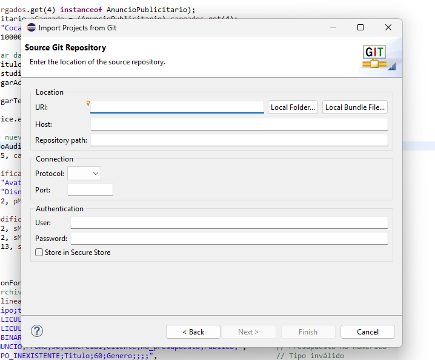
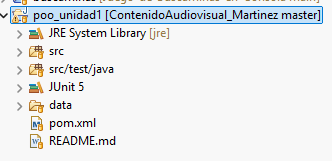
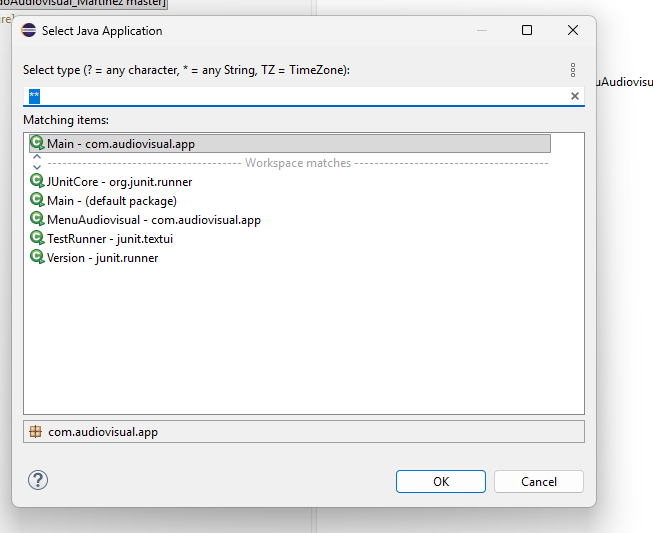

# 🎬 Sistema de Gestión de Contenido Audiovisual

¡Bienvenido al **Sistema de Gestión de Contenido Audiovisual**! Este proyecto es una aplicación Java de consola robusta, modular y altamente extensible, reconstruida con los más altos estándares de calidad de software. Se ha diseñado aplicando de forma rigurosa los principios **SOLID**, patrones de diseño modernos y una separación limpia de responsabilidades (Clean Architecture / MVC conceptual).

---

## 🚀 Características Clave y Mejoras de Arquitectura

El sistema original ha sido completamente rediseñado y mejorado para ofrecer un rendimiento óptimo y una mantenibilidad sin precedentes:

*   **Modularidad de Paquetes**: Segmentación estricta del código en paquetes según su dominio y función (`core`, `models`, `app`).
*   **Relaciones POO Avanzadas**:
    *   **Composición**: Gestión estricta de `Temporadas` dentro de `SerieDeTV` (el ciclo de vida está 100% acoplado).
    *   **Agregación**: Asignación independiente de `Actores` a `Peliculas` y `Anuncios Publicitarios`.
    *   **Asociación**: Colaboración flexible entre `Documentales` o `Webinars` e `Investigadores`.
*   **Polimorfismo Real**: Sobrescritura dinámica del método abstracto `mostrarDetalles()` para presentar información especializada por tipo de contenido.
*   **Operaciones CRUD Completas**: Gestores (`Managers`) independientes para cada tipo de contenido audiovisual que garantizan una interfaz interactiva impecable en consola.

---

## 🛠️ Estructura del Proyecto

La nueva jerarquía del proyecto garantiza la separación de la lógica de negocio y la interfaz de usuario:

```
📂 src
 ┗ 📂 com
   ┗ 📂 audiovisual
     ┣ 📂 app
     ┃ ┗ 📜 MenuAudiovisual.java      # Interfaz de Consola y Punto de Entrada (Main)
     ┣ 📂 core
     ┃ ┗ 📜 ContenidoAudiovisual.java  # Clase Abstracta Base
     ┗ 📂 models
       ┣ 📂 actor
       ┃ ┗ 📜 Actor.java
       ┣ 📂 anuncio
       ┃ ┣ 📜 AnuncioPublicitario.java
       ┃ ┗ 📜 AnuncioManager.java
       ┣ 📂 documental
       ┃ ┣ 📜 Documental.java
       ┃ ┗ 📜 DocumentalManager.java
       ┣ 📂 investigador
       ┃ ┗ 📜 Investigador.java
       ┣ 📂 pelicula
       ┃ ┣ 📜 Pelicula.java
       ┃ ┗ 📜 PeliculaManager.java
       ┣ 📂 serietv
       ┃ ┣ 📜 SerieDeTV.java
       ┃ ┗ 📜 SerieTVManager.java
       ┣ 📂 temporada
       ┃ ┗ 📜 Temporada.java
       ┗ 📂 webinar
         ┣ 📜 Webinar.java
         ┗ 📜 WebinarManager.java
```

---

## 📦 Clases y Tipos de Contenido Soportados

| Clase | Relación Clave | Concepto POO Aplicado | Descripción |
| :--- | :--- | :--- | :--- |
| **Pelicula** | `Actor` | Agregación | Largometrajes con reparto de actores independientes. |
| **SerieDeTV** | `Temporada` | Composición | Series de televisión formadas por múltiples temporadas. |
| **Documental** | `Investigador` | Asociación | Producciones científicas o culturales guiadas por investigadores. |
| **Webinar** | `Investigador` | Asociación | Seminarios virtuales con temas académicos y fechas programadas. |
| **AnuncioPublicitario** | `Actor` | Agregación | Clips comerciales de marcas con actores promocionales. |

---

## 📓 Tutorial de Uso: Importar y Ejecutar en Eclipse IDE

Sigue paso a paso esta guía visual para clonar, configurar e iniciar el proyecto de forma correcta en tu entorno de desarrollo **Eclipse**:

### 🌐 Paso 1: Configurar la URL de Git del Repositorio
Abre Eclipse IDE, dirígete a `File > Import...`, selecciona **Projects from Git (with smart import)** o simplemente la opción para clonar mediante URI. Pega la URL de tu repositorio en el campo **URI**. Eclipse detectará de forma automática el host y la ruta.

> [!TIP]
> **URL del Repositorio:**
> `https://github.com/AlexanderMartinez0410/ContenidoAudiovisual_Martinez.git`



---

### 📁 Paso 2: Confirmar el Repositorio Clonado e Importar
Una vez descargado el repositorio de forma local, Eclipse escaneará la estructura. Confirma la importación del proyecto. En tu explorador de paquetes (Package Explorer) deberás ver la jerarquía limpia de paquetes organizada como se muestra en la captura:



---

### ⚙️ Paso 3: Ejecución del Proyecto o Pruebas Unitarias (Run As)
Haz clic derecho sobre el proyecto o la clase que desees ejecutar y selecciona la opción **Run As**. Desde este menú podrás iniciar la aplicación de consola interactiva o correr las pruebas unitarias integradas para validar que toda la lógica de negocio y CRUD funcione perfectamente:


---

### 🏃 Paso 4: Selección del Main y Consola Interactiva
Si eliges correrlo como aplicación Java, asegúrate de seleccionar la clase principal **`MenuAudiovisual`** en el cuadro de diálogo para abrir la interfaz en consola.



> [!IMPORTANT]
> Una vez hecho esto, la consola de Eclipse se abrirá en la parte inferior permitiéndote interactuar con el menú completo del sistema CRUD para gestionar tus contenidos en tiempo real.

---

## 📋 Requisitos del Sistema

*   **Java SE Development Kit (JDK)**: Versión 17 o superior.
*   **Entorno de Desarrollo**: Eclipse IDE (versión 2022 o más reciente recomendada).
*   **Git**: Para control de versiones y clonación interactiva.

---

Desarrollado y optimizado por **Alexander Martínez** (2026).
